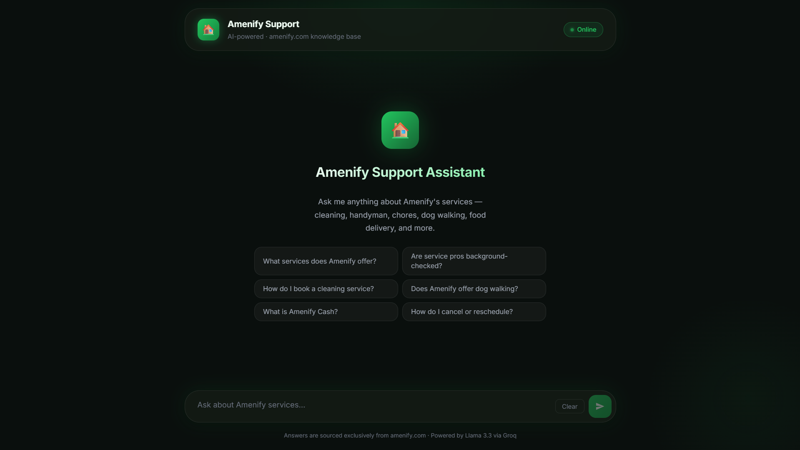
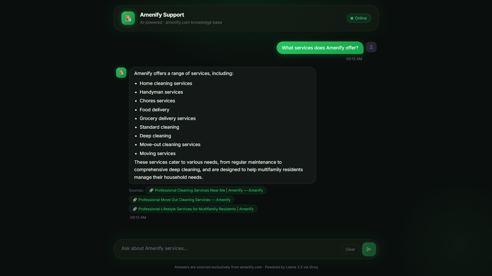
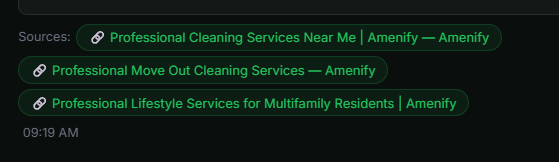
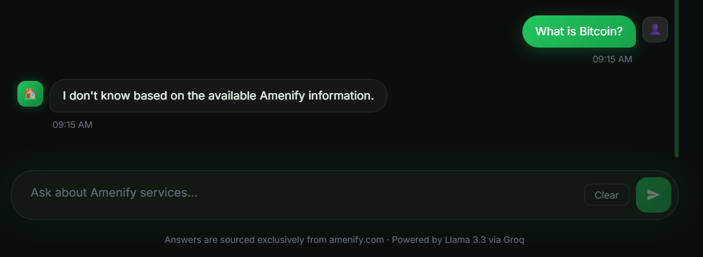
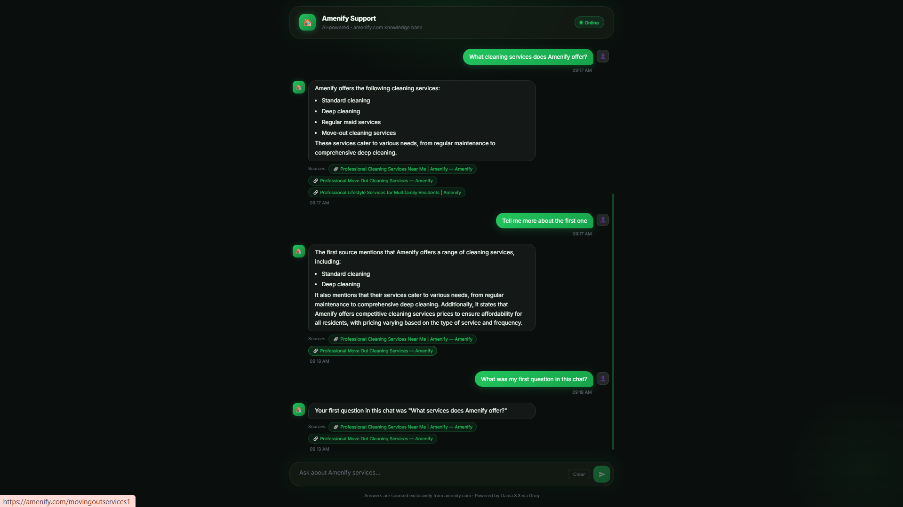
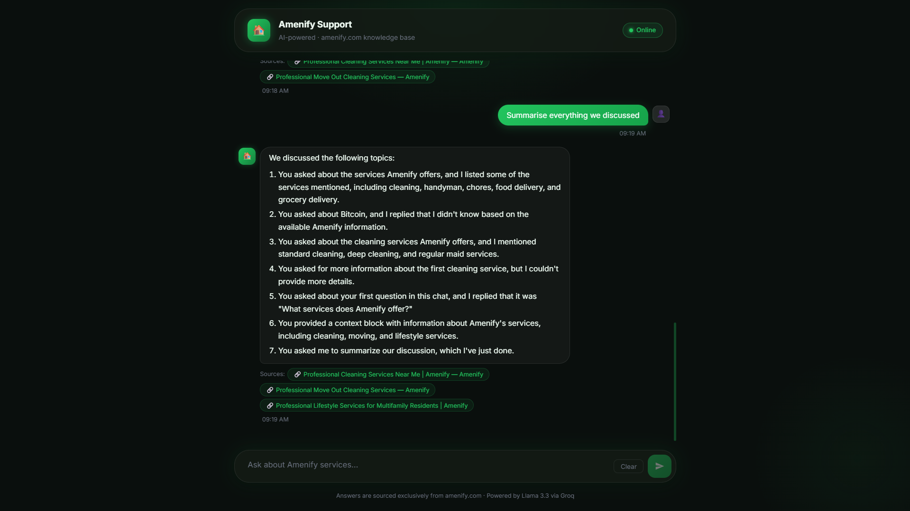
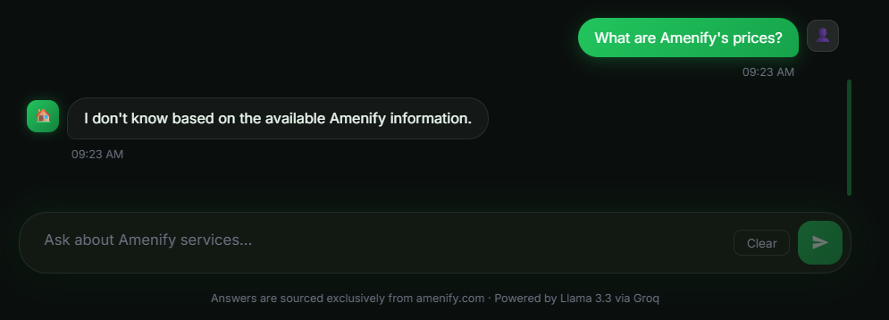
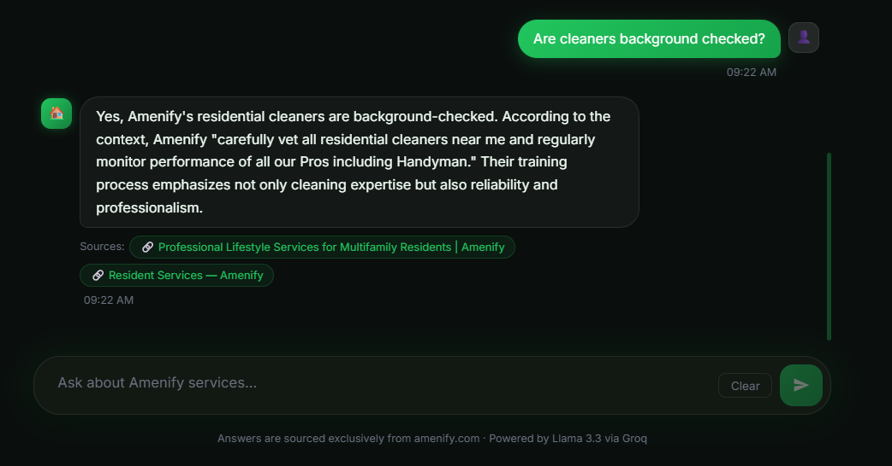
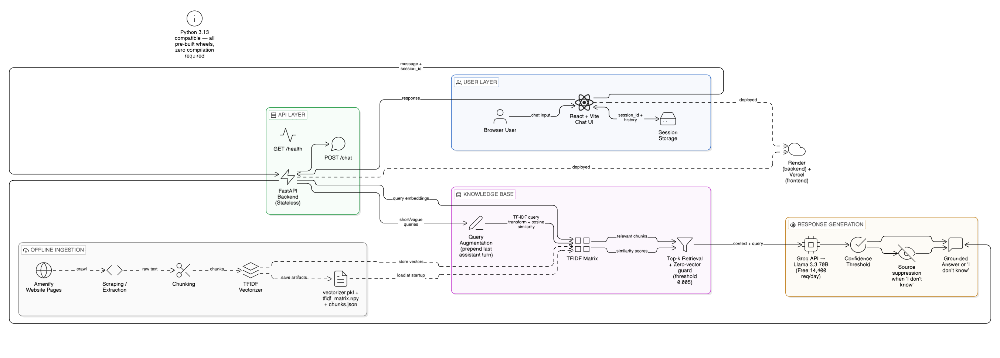

# 🏠 Amenify AI Customer Support Chatbot

> **Amenify Summer 2026 — Software Engineering Internship Assignment**

An AI-powered customer support chatbot that answers questions **exclusively** from content scraped from [amenify.com](https://amenify.com). Built with a Python FastAPI backend, a TF-IDF retrieval engine, and a React + Vite frontend. Zero compilation dependencies — runs cleanly on Python 3.13.

---

## 📺 Live Demo

| Component | URL |
|---|---|
| 🌐 Frontend (Vercel) | *(add your Vercel URL after deployment)* |
| ⚙️ Backend API (Render) | *(add your Render URL after deployment)* |
| 📖 API Docs (Swagger UI) | `https://your-render-url.onrender.com/docs` |

---

## 🖼️ Demo Screenshots

### Welcome Screen


### Requirement 1 — Knowledge base answers (amenify.com only)


### Requirement 4 — Grounded answers with source citations


### Requirement 5 — "I don't know" for off-topic questions


### Requirement 6 — Chat history maintained within a session


### Requirement 6 — Conversation context & summary


### Edge case — Prices not available on amenify.com


### Edge case — Background check query


---

## 🏗️ Architecture



```
┌─────────────────────────────────────────────────────────────────┐
│                    OFFLINE INGESTION  (run once)                 │
│                                                                   │
│  amenify.com (17 pages)                                          │
│       │                                                           │
│       ▼  scraper.py (requests + BeautifulSoup4)                  │
│  Raw HTML text                                                    │
│       │                                                           │
│       ▼  chunker.py (300-token chunks, 50-token overlap)         │
│  96 text chunks + metadata (source_url, page_title)              │
│       │                                                           │
│       ▼  embedder.py (scikit-learn TF-IDF)                       │
│  backend/data/                                                    │
│  ├── vectorizer.pkl     ← fitted TfidfVectorizer                 │
│  ├── tfidf_matrix.npy   ← L2-normalised (96 × 8000) matrix      │
│  └── chunks.json        ← chunk metadata                         │
└─────────────────────────────────────────────────────────────────┘
                              │ committed to Git
                              ▼
┌─────────────────────────────────────────────────────────────────┐
│                   BACKEND  FastAPI on Render                     │
│                                                                   │
│  POST /chat                                                       │
│    │                                                              │
│    ├── retriever.py                                               │
│    │     • Query augmentation (prepend last assistant turn        │
│    │       for short/vague follow-up queries)                     │
│    │     • TF-IDF transform → cosine similarity                   │
│    │     • Zero-vector guard (unknown terms → "I don't know")     │
│    │     • Confidence threshold filter (default 0.005)            │
│    │                                                              │
│    └── generator.py                                               │
│          • Build <context> block from top-4 chunks                │
│          • Strict grounding system prompt                         │
│          • Groq API → Llama 3.3 70B (free)                       │
│          • Suppress sources when "I don't know"                   │
│                                                                   │
│  GET  /health  → { status: "ok" }                                │
└─────────────────────────────────────────────────────────────────┘
                              │
                              ▼
┌─────────────────────────────────────────────────────────────────┐
│                   FRONTEND  React + Vite on Vercel               │
│                                                                   │
│  • Dark glassmorphism chat UI                                     │
│  • sessionStorage for chat history (per-tab, survives refresh)   │
│  • Sends last 10 turns of history with every request             │
│  • Green source chips link to amenify.com pages                  │
│  • Suggestion chips on welcome screen                             │
└─────────────────────────────────────────────────────────────────┘
```

**Complete request flow:**
```
User types question
      │
      ▼
Frontend (React) — sends { message, history[] }
      │
      ▼
POST https://api.onrender.com/chat
      │
      ├─ Query augmentation (prepend last answer if short query)
      ├─ TF-IDF retrieval (top-4 chunks, cosine similarity)
      ├─ Confidence check — if all scores < 0.005 → "I don't know"
      └─ Groq Llama 3.3 70B generates grounded answer
            │
            ▼
      { answer, sources[] }
            │
            ▼
Frontend renders answer + clickable source chips
Chat history saved to sessionStorage
```

---

## 📁 Project Structure

```
amenify-chatbot/
│
├── backend/                    # FastAPI application → deploy to Render
│   ├── main.py                 # Entry point: /health + /chat endpoints
│   │                           #   + query augmentation for follow-up questions
│   ├── retriever.py            # TF-IDF retrieval engine
│   │                           #   • loads vectorizer.pkl + tfidf_matrix.npy
│   │                           #   • cosine similarity via numpy dot product
│   │                           #   • zero-vector guard for unknown terms
│   ├── generator.py            # Groq/Llama 3.3 70B answer generation
│   │                           #   • strict grounding system prompt
│   │                           #   • suppresses sources on "I don't know"
│   ├── models.py               # Pydantic request/response models
│   ├── config.py               # All config loaded from env vars
│   ├── requirements.txt        # Python 3.13-compatible, pre-built wheels only
│   ├── .env.example            # Template — copy to .env and fill in key
│   └── data/                   # Generated by ingestion pipeline (committed)
│       ├── vectorizer.pkl      # Fitted scikit-learn TfidfVectorizer
│       ├── tfidf_matrix.npy    # L2-normalised TF-IDF matrix (96 × 8000)
│       └── chunks.json         # Chunk metadata (text, source_url, page_title)
│
├── ingestion/                  # Run once locally to build the knowledge base
│   ├── run_pipeline.py         # Master script: scrape → chunk → embed
│   ├── scraper.py              # requests + BeautifulSoup4, 17 curated URLs
│   ├── chunker.py              # 300-token chunks with 50-token overlap
│   ├── embedder.py             # scikit-learn TF-IDF vectorizer + matrix
│   └── requirements.txt
│
├── frontend/                   # React + Vite chat UI → deploy to Vercel
│   ├── index.html
│   ├── vite.config.js
│   ├── package.json
│   ├── .env.example            # VITE_API_URL template
│   └── src/
│       ├── App.jsx             # Root: state management, API calls, sessionStorage
│       ├── index.css           # Dark glassmorphism design system
│       └── components/
│           ├── ChatWindow.jsx  # Message list + welcome screen chips
│           ├── MessageBubble.jsx # Renders markdown + source chips
│           └── InputBar.jsx    # Text input with Shift+Enter support
│
├── demo/                       # Screenshots demonstrating all requirements
│   ├── architecture.png        # System architecture diagram
│   └── *.png                   # Test screenshots for each requirement
│
└── README.md
```

---

## ⚡ Quick Start (Local Development)

### Prerequisites

| Requirement | Version |
|---|---|
| Python | 3.11+ (tested on 3.13) |
| Node.js | 18+ |
| Groq API key | Free — [console.groq.com](https://console.groq.com) |

> **Why Groq?** Groq offers completely free inference (14,400 req/day, no credit card) on Llama 3.3 70B — a state-of-the-art open model.

---

### Step 1 — Clone and create virtual environment

```bash
git clone https://github.com/your-username/amenify-chatbot.git
cd amenify-chatbot

python -m venv .venv

# Activate (Windows PowerShell):
.\.venv\Scripts\Activate.ps1

# Activate (macOS/Linux):
source .venv/bin/activate
```

### Step 2 — Install dependencies

```bash
pip install -r backend/requirements.txt
pip install -r ingestion/requirements.txt
```

### Step 3 — Configure environment variables

```bash
# Copy the template
cp backend/.env.example backend/.env
```

Open `backend/.env` and add your Groq API key:

```
GROQ_API_KEY=gsk_your_key_here
CHAT_MODEL=llama-3.3-70b-versatile
TOP_K=4
CONFIDENCE_THRESHOLD=0.005
ALLOWED_ORIGINS=http://localhost:5173,http://localhost:3000
```

Get a free key at **https://console.groq.com** → API Keys → Create API Key.

### Step 4 — Run the ingestion pipeline *(one-time only)*

```bash
python ingestion/run_pipeline.py
```

This scrapes 17 Amenify pages, builds 96 text chunks, and creates the TF-IDF index.
Takes ~30 seconds. No API key needed — all local processing.

Output files committed to Git (so Render doesn't need to re-run this):
```
backend/data/vectorizer.pkl
backend/data/tfidf_matrix.npy
backend/data/chunks.json
```

### Step 5 — Start the backend

```bash
cd backend
uvicorn main:app --reload --port 8000
```

Verify: http://localhost:8000/health → `{"status":"ok"}`  
API docs: http://localhost:8000/docs

### Step 6 — Start the frontend

```bash
cd frontend
npm install
npm run dev
```

Open **http://localhost:5173** in your browser.

---

## 🚀 Deployment

The application is deployed across two platforms:

| Component | Platform | Notes |
|---|---|---|
| Backend (FastAPI) | [Render](https://render.com) | Free tier · auto-deploy from Git · Python 3 runtime |
| Frontend (React/Vite) | [Vercel](https://vercel.com) | Free tier · auto-deploy from Git · Vite preset |

### Infrastructure

**Backend (Render)**
- Root directory: `backend/`
- Build: `pip install -r requirements.txt`
- Start: `uvicorn main:app --host 0.0.0.0 --port $PORT`
- Environment variables: `GROQ_API_KEY`, `CHAT_MODEL`, `CONFIDENCE_THRESHOLD`, `TOP_K`, `ALLOWED_ORIGINS`
- The knowledge base artifacts (`vectorizer.pkl`, `tfidf_matrix.npy`, `chunks.json`) are committed to the repo so the server loads them instantly at startup without re-scraping.

**Frontend (Vercel)**
- Root directory: `frontend/`
- Framework preset: Vite (auto-detected)
- Environment variable: `VITE_API_URL` → set to the Render backend URL
- CORS is configured via `ALLOWED_ORIGINS` on the backend, which includes the Vercel deployment URL.

> ⚠️ **Render free tier note:** The service spins down after 15 minutes of inactivity. The first request after idle takes ~30 seconds (cold start). This is a free-tier constraint and does not affect functionality.

---

## 🧪 Example Queries & Expected Outputs

| Query | Expected Behaviour | Requirement |
|---|---|---|
| `What services does Amenify offer?` | Lists cleaning, handyman, chores, dog walking, food/grocery delivery + source links | #1, #4 |
| `Are Amenify's service pros background-checked?` | Yes — explains vetting, training, monitoring process | #4 |
| `Does Amenify offer dog walking?` | Yes — confirms with service details | #4 |
| `Tell me about move out cleaning` | Deposit protection, deep clean details | #4 |
| `How does Amenify help property managers?` | Platform, PMS integrations, resident perks | #4 |
| `What is Amenify Cash?` | Explains the credits/incentive program | #4 |
| `What is Bitcoin?` | `"I don't know based on the available Amenify information."` — no sources | #5 |
| `What are Amenify's prices?` | `"I don't know based on the available Amenify information."` — prices not published | #5 |
| `Who is the CEO of Google?` | `"I don't know based on the available Amenify information."` | #5 |
| `Tell me more about the first one` *(after asking about services)* | Correctly continues the topic using chat history | #6 |
| `What was my first question?` | Recalls the conversation opener from session history | #6 |
| `Summarise everything we discussed` | Full conversation summary | #6 |

---

## 🧠 Section 3: Reasoning & Design

### 1. How did you ingest and structure the data from the website?

Scraped **17 curated high-signal pages** from amenify.com using `requests` + `BeautifulSoup4`. Navigation, scripts, ads, and footers were stripped to leave only body content. The clean text was chunked into **~300-token segments with 50-token overlap** so context is not lost at chunk boundaries. Each chunk carries metadata: `source_url`, `page_title`, `chunk_id`.

Instead of neural embeddings (which require GPU or API credits), the chunks are indexed using **scikit-learn's TF-IDF vectorizer** with bigrams, sublinear TF weighting, and L2-normalised vectors. This produces a `(96 × 8000)` sparse-then-dense matrix. At query time, the same vectorizer transforms the query into a sparse vector; cosine similarity is computed via efficient numpy dot product. All 3 artifacts (`vectorizer.pkl`, `tfidf_matrix.npy`, `chunks.json`) are committed to Git so the server loads them instantly at startup.

### 2. How did you reduce hallucinations?

Four layers of protection:

1. **Strict system prompt** — The LLM is explicitly instructed: *"Answer ONLY using information explicitly stated in the `<context>` block. Do NOT infer, estimate, or paraphrase information that isn't clearly written."*
2. **Confidence threshold** — Before calling the LLM, if no chunk scores above the cosine similarity threshold (default 0.005), the API short-circuits and returns `"I don't know"` immediately — zero tokens consumed.
3. **Zero-vector guard** — If the query contains no vocabulary that exists in the Amenify corpus (e.g. `"bitcoin"`, `"ethereum"`), the TF-IDF query vector is all zeros, detected instantly, and the system returns `"I don't know"` without retrieval.
4. **Low temperature** — Generation uses `temperature=0.2` to favour factual, conservative completions over creative ones.
5. **Source suppression** — When the answer is "I don't know", source chips are hidden so users aren't confused by irrelevant citations.

### 3. What are the limitations of your approach?

- **Static index** — The knowledge base must be manually re-scraped when amenify.com changes. No live sync.
- **TF-IDF keyword matching** — Retrieval is exact-keyword-based, not semantic. Queries using synonyms or paraphrases may miss relevant chunks (e.g. "house cleaner" vs "maid services").
- **Client-side history** — Chat history is stored in `sessionStorage` and re-sent with each request. For long conversations the token count grows linearly. No backend persistence.
- **No personal account data** — The bot can't answer questions about a specific user's bookings, payments, or account status.
- **JavaScript-rendered pages** — Squarespace pages that rely on JS for rendering may not yield full text with `requests`-based scraping.
- **Short/vague follow-ups** — Mitigated by query augmentation (prepending last assistant turn), but semantic retrieval would handle this more robustly.

### 4. How would you scale this system?

- Replace TF-IDF + flat file with **Pinecone, Weaviate, or Qdrant** — managed vector stores with auto-updates, filtering, and horizontal scaling.
- Add a **Redis semantic cache** — cache (query embedding, answer) pairs to serve repeated questions instantly without LLM calls.
- Move ingestion to a **scheduled Cloud Run or GitHub Actions job** that re-scrapes and re-indexes weekly (or on CMS publish webhook).
- Switch to **streaming responses** (FastAPI + SSE) for perceived speed gains.
- Add a **query rewriting step** — a small LLM call that reformulates ambiguous queries before retrieval.
- **Horizontal backend scaling** — containerise with Docker, deploy behind a load balancer on GCP Cloud Run or AWS ECS.

### 5. What improvements would you make for production use?

- **Neural embeddings** — Replace TF-IDF with `text-embedding-3-small` or a local `sentence-transformers` model for semantic retrieval, dramatically improving accuracy on paraphrased queries.
- **Thumbs up/down feedback** — Log user ratings and use them to tune the confidence threshold and identify gaps in the knowledge base.
- **Evaluation pipeline** — Integrate `ragas` to measure faithfulness, answer relevance, and context recall on a golden test set (automated regression testing).
- **Live data ingestion** — CMS webhook → re-scrape → re-index pipeline for near-real-time knowledge base updates.
- **PII masking** — Strip any personal information from user messages before logging or storing.
- **Multi-language support** — Detect query language, translate to English before retrieval, translate answer back (for Amenify's diverse resident base).
- **Analytics dashboard** — Track most-asked questions, "I don't know" rate, top sources cited, and threshold tuning opportunities.
- **Persistent session storage** — Move history to a backend Redis session for multi-device support and analytics.

---

## 🛠️ Tech Stack

| Layer | Technology | Why |
|---|---|---|
| **Scraping** | Python, `requests`, `BeautifulSoup4` | Lightweight, no headless browser needed |
| **Text chunking** | Custom Python (300-token, 50-overlap) | Preserves context at boundaries |
| **Retrieval** | `scikit-learn` TF-IDF + `numpy` cosine similarity | Pre-built wheels for Python 3.13, zero compilation |
| **Backend** | Python 3.13, FastAPI, Uvicorn | Fast, async, auto-docs, type-safe |
| **LLM** | Llama 3.3 70B via Groq API | 100% free tier, 14,400 req/day, OpenAI-compatible |
| **Frontend** | React 18, Vite 5, pure CSS | Fast HMR, no framework lock-in |
| **Session storage** | Browser `sessionStorage` | Per-tab isolation, no backend state |
| **Backend hosting** | [Render](https://render.com) | Free tier, auto-deploy from Git |
| **Frontend hosting** | [Vercel](https://vercel.com) | Free tier, optimised for Vite/React |

---

## 🔌 API Reference

### `GET /health`
Health check used by Render's uptime monitor.

**Response:**
```json
{"status": "ok", "service": "amenify-chatbot-api"}
```

### `POST /chat`
Main chatbot endpoint.

**Request body:**
```json
{
  "message": "What services does Amenify offer?",
  "history": [
    {"role": "user", "content": "previous question"},
    {"role": "assistant", "content": "previous answer"}
  ]
}
```

**Response:**
```json
{
  "answer": "Amenify offers cleaning, handyman, chores...",
  "sources": [
    {
      "url": "https://amenify.com/resident-services",
      "title": "Resident Services — Amenify"
    }
  ]
}
```

**Error responses:**

| Code | Meaning |
|---|---|
| `422` | Invalid request body (Pydantic validation) |
| `500` | `GROQ_API_KEY` missing or Groq API error |

---

## 👤 Author

**Built for:** Amenify Summer 2026 Software Engineering Internship  
**LinkedIn:** *(add your LinkedIn URL)*
